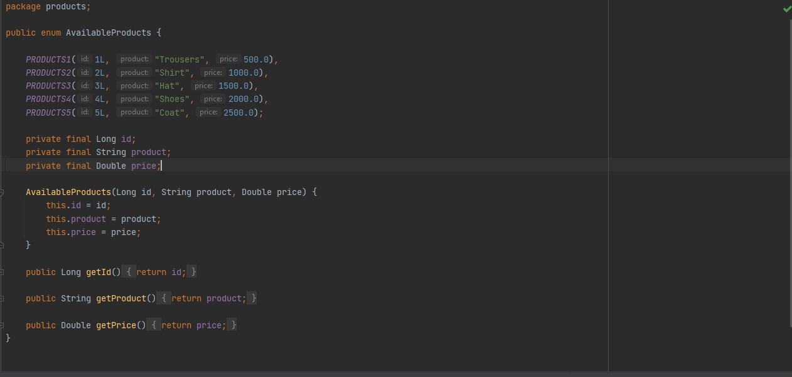
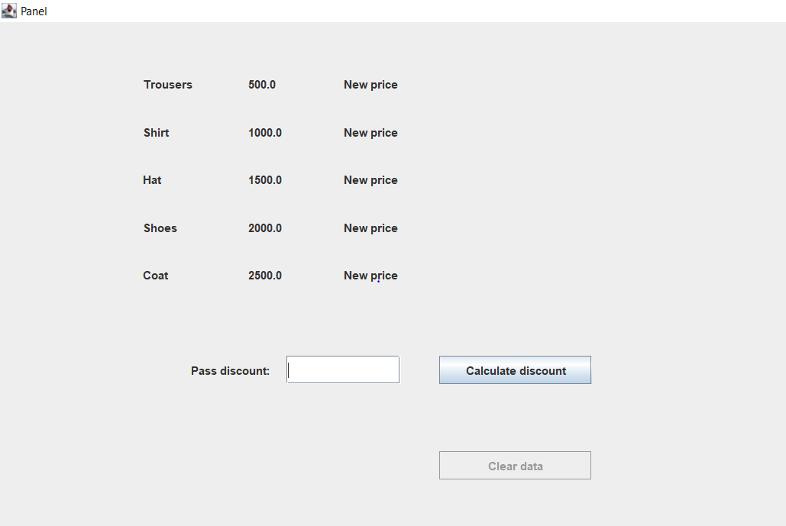
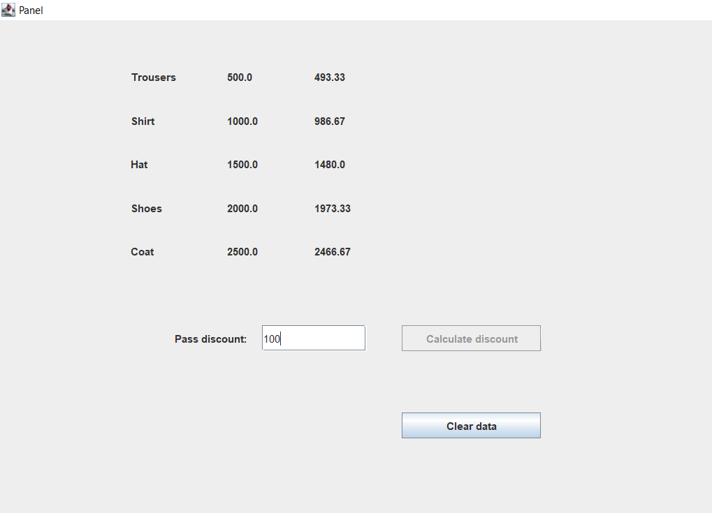

# Calculate discount application

The project presents an application for calculating a discount. The discount rate is calculated from the given range of items based on their prices. 
Technology stack:
- Java 11
- Swing
- JUnit
- Maven 

How to run application:
```
1.mvn package
2.java -cp target/rabat-1.0-SNAPSHOT.jar layout.RabatApplication
```

After launching, we will get an application window in the upper left corner

The input element is the enum class. It is presented in the photo below:



After a series of calculations, the application view is launched. It is presented in the photo below:



After entering the discount amount in the text field, the discount amount for each item is calculated. It is presented in the photo below:



The application has completed unit tests. They are available in the RabatTest.java class.


